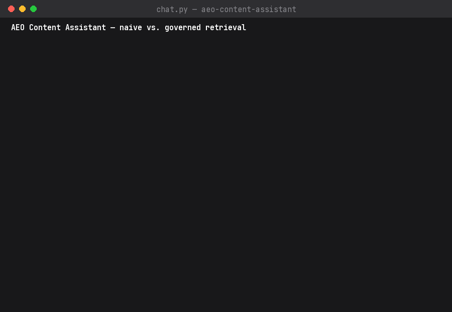

# AEO Content Assistant

A portfolio project demonstrating **AEO / content-governance** discipline in a RAG chatbot.

It runs two retrieval modes side by side over the same fictional digital-banking help-center knowledge base:

- **Naive retrieval** — pure text search (TF-IDF + cosine similarity), no awareness of article status, freshness, or supersession.
- **Governed retrieval** — filters to published, current (non-superseded) content before ranking, and explicitly flags gaps instead of guessing.

An eval harness scores both modes against 15 realistic support questions to make the difference concrete, not just asserted:

```
NAIVE:    6/15  (40%)
GOVERNED: 13/15 (87%)
```

## Demo



Left: naive retrieval confidently answers a wire-transfer-limit question from a **retired** article ($25,000, superseded in August 2026). Governed retrieval filters it out and answers from the current one ($50,000). Right: asked about a topic with only unreviewed draft content, governed retrieval flags a content gap instead of serving the draft as fact.

See `case_study.md` for the full writeup, including the one failure mode governance *doesn't* fix (a query-disambiguation "honest miss," kept in on purpose).

## Setup

```
pip3 install -r requirements.txt
```

No API key, no external service — everything runs locally with scikit-learn.

## Try it

```
python3 eval/run_eval.py     # reproduce the 6/15 vs 13/15 scores
python3 chat.py              # ask your own questions, toggle modes live
```

## Project structure

```
kb/          16 help-center articles as JSON, each with governance metadata
retrieval/   naive.py and governed.py retrieval implementations
eval/        eval question set + scoring harness
chat.py      interactive CLI — toggle between modes live
case_study.md
assets/      demo GIF
```
